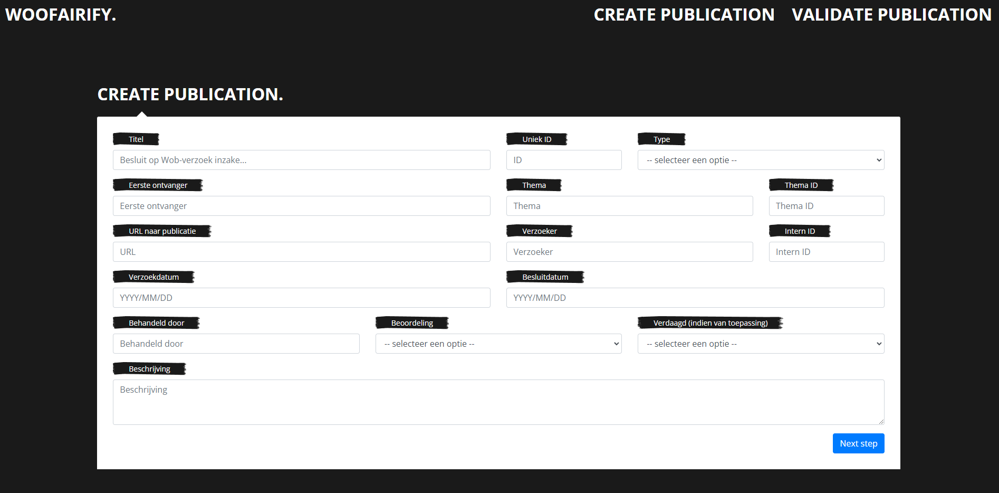
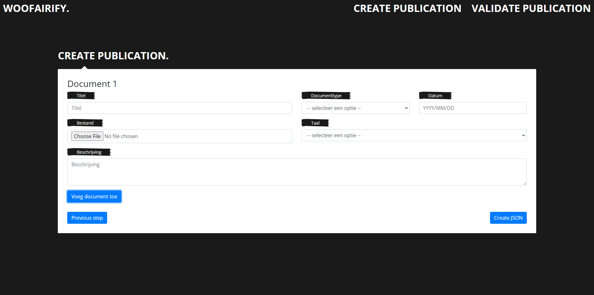
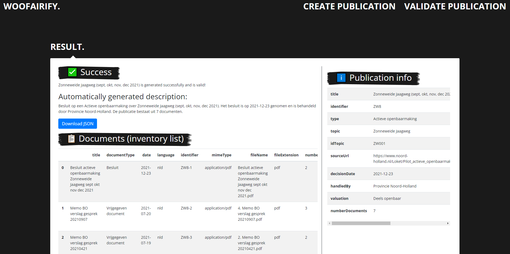
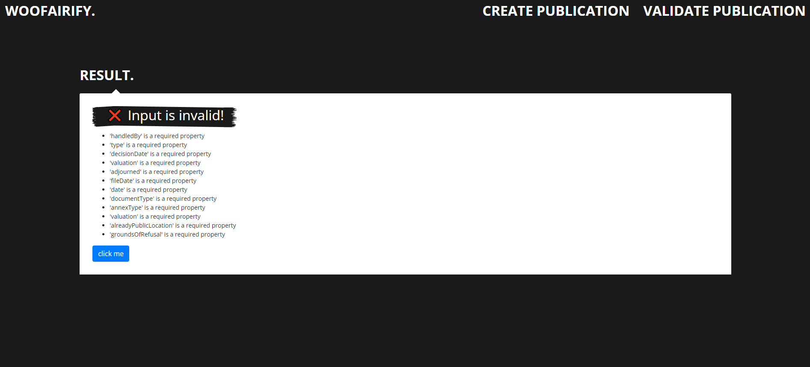

# WooFAIRify
Auteur: Maik Larooij (Universiteit van Amsterdam)

## Omschrijving
WooFAIRify is een simpele tool om Woo ([Wet open overheid](https://www.rijksoverheid.nl/onderwerpen/wet-open-overheid-woo)) besluiten te creëren en publiceren op een transparante wijze. Op deze manier voldoen de publicaties aan de FAIR data principes die zijn opgesteld door [Wilkinson et al. (2016)](https://www.nature.com/articles/sdata201618?ref=https://githubhelp.com). 

Een publicatie creëren kan met de volgende stappen:
1. Vul de gegevens van de publicatie in. Voor meer informatie over de mogelijke gegevens, bekijk de [schema specificatie](documentation/schema_spec.md).

2. Vul de gegevens van de bijbehorende vrij te geven documenten in. Ook deze staan in de [schema specificatie](documentation/schema_spec.md).

3. Klik op 'Maak JSON'. De ingevulde gegevens worden nu gevalideerd. Dit gebeurt door [JSON Schema](https://json-schema.org/). Een JSON Schema met daarin de regels waarop gevalideerd wordt is [hier te vinden](validation/validationSchema.json).
4. Afhankelijk van de validiteit van de ingevulde gegevens verschijnt er een resultaatpagina. Wanneer de gegevens netjes aan de regels voldoen, verschijnt een volgend scherm.

Mochten de gegevens niet valide zijn (ze voldoen niet aan de opgestelde eisen), dan verschijnt er een pagina met de gegevens van de validatie.


## Demo met voorbeeld

De hierboven geschetste stappen kunnen uitgevoerd worden op <https://woofairify.herokuapp.com/>. Het voorbeeld hieronder is uitgewerkt op <https://woofairify.herokuapp.com/exampleproduction>.

## Voorbeeld
[documentation/example publication](documentation/example%20publication) bevat een voorbeeldpublicatie. Het bevat de openbaar gemaakte documenten als losse pdf bestanden. Daarnaast is er een map met metadata waarin de ingevulde gegevens zijn te vinden in de vorm van een JSON (volledige publicatie) en een inventarislijst CSV (de losse documenten). 

Ingekort voorbeeld van de metadata van een publicatie:
```
{
    "title": "Zonneweide Jaagweg (sept, okt, nov, dec 2021)",
    "identifier": "ZW8",
    "type": "Actieve openbaarmaking",
    "topic": "Zonneweide Jaagweg",
    "idTopic": "ZW001",
    "sourceUrl": "https://www.noord-holland.nl/Loket/Pilot_actieve_openbaarmaking/Documenten/Zonneweide_Jaagweg_sept_okt_nov_dec_2021",
    "decisionDate": "2021-12-23",
    "handledBy": "Provincie Noord-Holland",
    "valuation": "Deels openbaar",
    "documents": [
        {
          "title": "Besluit actieve openbaarmaking Zonneweide Jaagweg sept okt nov dec 2021",
          "documentType": "Besluit",
          "date": "2021-12-23",
          "language": "nld",
          "identifier": "ZW8-1",
          "mimeType": "application/pdf",
          "fileName": "Besluit actieve openbaarmaking Zonneweide Jaagweg sept okt nov dec 2021.pdf",
          "fileExtension": "pdf",
          "numberPages": 2,
          "numberCharacters": 4069,
          "numberWords": 548,
          "numberTextPages": 2
        },
        {
          "title": "Memo BO verslag gesprek 20210907",
          "documentType": "Vrijgegeven document",
          "date": "2021-07-20",
          "language": "nld",
          "recipient": "Gedeputeerde Stigter, wethouder Van Dolder",
          "annexType": "Memo",
          "valuation": "Deels openbaar",
          "groundsOfRefusal": [
            "10.2.e"
          ],
          "identifier": "ZW8-2",
          "mimeType": "application/pdf",
          "fileName": "4. Memo BO verslag gesprek 20210907.pdf",
          "fileExtension": "pdf",
          "numberPages": 3,
          "numberCharacters": 4953,
          "numberWords": 766,
          "numberTextPages": 3
        }
    ]
}
``` 
